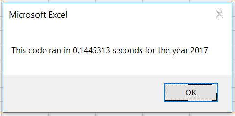

# Stock Analysis with Excel VBA

## Overview of Project
The parents of Steve, a recent Finance Graduate, are going to be Steve's 1st clients. They are fascinated about the prospects of Green Energy. They haven't done much research but have decided to invest 100% of their money on ***DAQO New Enery Corp***. Steve has promised his parents that he will look into DAQO stocks, he would also like them to diversify their investment. He wants to analyze some *green energy* stocks. He has come up with an spreadsheet with date on some stocks.

I have to use Excel VBA to code a program that organizes, sorts and analyzes the current date and can be reused by Steve with any Stock for any year.

### Purpose
The short-term purpose of this analysis is help Steve share the outcome of his analysis with his parents so that their hard-money can be invested in the right place. The long-term purpose is to give Steve a code to automate the analysis for any Stock data that he will have in the future. 

Another purpose was to make our code more effecient.

## Analysis Steps
We already had a peice of working code, we decided to refactor that code to get a more effecient code. 

***The idea was to reduce the number of times the code was going through all the rows in the dataset from n to 1 (where n is the number of tickers).***

Below are the steps that we undertook

1) In the new code, a new variable `tickerIndex` was introduced to access the elements of the array.
2) `tickerIndex` would not only access the elements of the array `tickers()` that was already present, but also let us create 3 new arrays `tickerVolumes`, `tickerStartingPrices`, and `tickerEndingPrices`
4) As the code in the `For` goes through all the rows, it will read the corresponding ticker, and do the following

a) if it is not the same ticker as in the last row, it will copy its closing price to the element `tickerStartingPrice(tickerIndex)`

b) if it is the ame ticker as in the last row, it will add the Volume of the row to the elemtnt `tickerVolumes(tickerIndex)`

c)if the ticker in the next row is not the same as the current row's ticker, it will copy the closing price of this row to the element `tickerClosingPrice(tickerIndex)`. Since the next ticker is a different one, the `tickerIndex` is increased by 1.

4) The values for `ticker`, `tickerVolumes` and `Return` are calculated using the variable `tickerIndex`

## Analysis Results
Since we had data for 2 years, 2018 and 2019; our analysis yielded resuls for 2017 and 2018 
1) Result based on 2017 data 

2) Result based on 2018 data

The result of the analysis is that `DQ` is the most fluctuating stock - while it was the top performing stock in the year 2017 with returns of +199.4%, but in 2018 it was the worst performing stock with return of -62%. A more stable stock is ENPH which gave good return in both years: 129% in 2017 and 81.9% in 2018. It seems RUN is also a good option, with +5.5% returns in 2017 and +84.0% in 2018 (one of the only 2 to be green in 2018)

## Refactoring Results

### Refactoring can improve the performace of code substantially
*Time taken to run the code for 2017 before refactoring: 0.961 seconds*

*Time taken to run the code for 2017 after refactoring: 0.144 seconds (**6.67x faster**)*

*Time taken to run the code for 2018 before refactoring: 1.180 seconds*

*Time taken to run the code for 2018 after refactoring: 0.230 seconds (**5.13x faster**)*

### Challenges and Difficulties Encountered
The instructions **Create a `tickerIndex` variable and set it equal to zero before iterating over all the rows.** confused me a lot. I initially thought that the ask is to create a dynamic array that would have the capability to process any **Tickers** (even those not mentioned in our dataset). I searched many resources for dynamic arays and this took me many hours. I read the instructions over and over but was stil not clear. I decided to look into the `challenge_starter_code` and it occoured to me that the ask is not to create dynamic arrays or introduce any new concepts, but to refactor the earlier code to make it more effecient.

Learning - if you are given a framework to write the solution, it is important to see that framework right after reading and digesting the instructions.

## Summary
### What are the advantages or disadvantages of refactoring code?
According to https://en.wikipedia.org/wiki/Code_refactoring - Refactoring is intended to improve the design, structure, and/or implementation of the software (its non-functional attributes), while preserving its functionality. Potential advantages of refactoring may include improved code readability and reduced complexity; these can improve the source code's maintainability and create a simpler, cleaner, or more expressive internal architecture or object model to improve extensibility. Another potential goal for refactoring is improved performance; software engineers face an ongoing challenge to write programs that perform faster or use less memory.

On a flip side, refactoring a code almost usually takes more time than writing the original code as we are working on *fixing* a code that isn't broken. Then, there are chances of introduction of bugs and errors.

### How do these pros and cons apply to refactoring the original VBA script?
As we saw, refactoring made the code almost 5x-6x times faster. It also made it more readable and easier to debug. On the other side, it took me almost 3x to refactor the code than to write the original code.  

